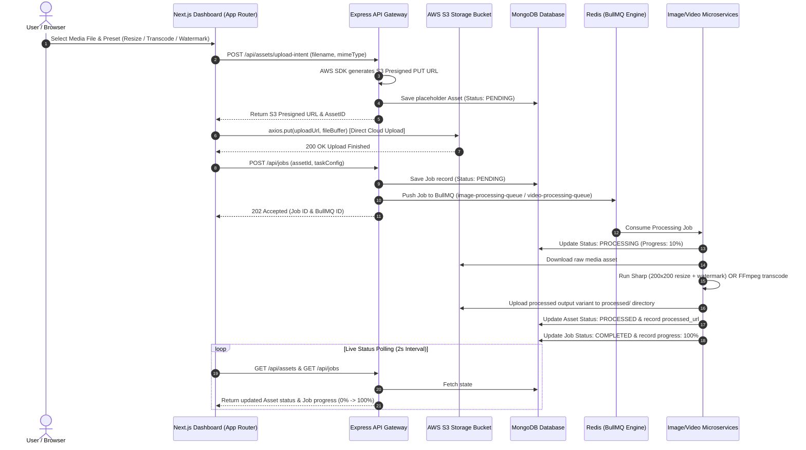

# 🚀 MediaFlow: Distributed Cloud Media Processing Platform

[](https://mediaflow-platform.vercel.app)
[](https://nextjs.org/)
[](https://expressjs.com/)
[](https://www.mongodb.com/)
[](https://bullmq.io/)
[](https://redis.io/)
[](https://www.typescriptlang.org/)
[](https://aws.amazon.com/s3/)

> **MediaFlow** is an enterprise-grade, microservice-based distributed cloud media processing platform designed using Node.js, Next.js (App Router), MongoDB, BullMQ, Redis, Sharp, and Fluent-FFmpeg. It decouples API Gateway request handling from CPU/GPU-intensive image transformation and video transcoding tasks using asynchronous distributed workers.

---

## 🌟 Live Demo & Deployments

- **🌐 Live Production Dashboard (Vercel)**: [https://mediaflow-platform.vercel.app](https://mediaflow-platform.vercel.app)
- **💻 GitHub Repository**: [https://github.com/navsharma26/mediaflow](https://github.com/navsharma26/mediaflow)

---

## 🏗️ System Architecture & Sequence Flow



---

## 💡 Key Features & Architectural Capabilities

### 1. ⚡ High-Throughput API Gateway
- Express.js REST API with JWT Authentication (`/api/auth/register`, `/api/auth/login`).
- `POST /api/assets/upload-intent` endpoint generating secure AWS S3 Presigned URLs for direct browser-to-cloud file uploads.
- Rate limiting, security headers (`helmet`), and CORS protection.

### 2. 🔄 Asynchronous BullMQ & Redis Messaging
- Decouples client request loops from heavy media processing tasks.
- Exponential backoff retries, concurrency controls, and real-time execution progress updates (`0%` -> `100%`).

### 3. 🖼️ Image Worker Microservice (`sharp`)
- Standalone worker process consuming `image-processing-queue`.
- Performs fast `200x200` thumbnail resizing with smart gravity cropping.
- Composites dynamic SVG text watermarks over images.
- Format conversions (WebP, AVIF, PNG, JPEG).

### 4. 🎥 Video Worker Microservice (`fluent-ffmpeg`)
- Standalone worker process consuming `video-processing-queue`.
- Transcodes video files across standard resolution scaling presets (`1080p`, `720p`, `480p`, `360p`).
- Screenshot thumbnail extraction at configurable timestamps.

### 5. 🪟 Next.js 14 App Router User Dashboard
- Dark glassmorphism UI with real-time job execution monitor.
- Dynamic `AssetCard` and `JobCard` components displaying status badges (`Queued`, `Processing`, `Completed`, `Failed`).
- Direct S3 `axios.put` cloud upload integration.

### 6. 🗄️ Pluggable Abstract Storage Layer (`IStorageProvider`)
- Modular storage provider interface enabling effortless switching between `LocalStorageProvider` (for local development) and `S3StorageProvider` (AWS S3 / Cloudflare R2 for production).

---

## 📁 Repository Directory Structure

```
mediaflow/
├── vercel.json                          # Vercel Monorepo deployment configuration
├── docker-compose.yml                   # Local MongoDB & Redis service containers
├── package.json                         # Monorepo workspaces definition
├── README.md
│
├── packages/                            # Shared internal workspace libraries
│   ├── shared-types/                    # TypeScript interfaces (IUser, IAsset, IJob)
│   └── storage-service/                 # Abstract Storage Provider (Local FS & AWS S3)
│
└── apps/                                # Distributed microservices & frontend
    ├── api-gateway/                     # Express REST Gateway & Mongoose Models
    ├── image-worker/                    # Microservice worker for Sharp image pipeline
    ├── video-worker/                    # Microservice worker for FFmpeg video pipeline
    └── frontend/                        # Next.js 14 App Router User Dashboard
```

---

## 🛠️ Local Installation & Quickstart

### Prerequisites
- Node.js `v18+` or `v20+`
- MongoDB (`v7.0+`) & Redis (`v7.2+`)

### 1. Clone & Install Dependencies
```bash
git clone https://github.com/navsharma26/mediaflow.git
cd mediaflow
npm install
```

### 2. Environment Setup
Create a `.env` file in the root directory (or copy `.env.example`):
```env
NODE_ENV=development
PORT=5001
MONGODB_URI=mongodb://localhost:27017/mediaflow
REDIS_HOST=localhost
REDIS_PORT=6379
JWT_SECRET=mediaflow_super_secret_jwt_key_2026

STORAGE_DRIVER=local
LOCAL_STORAGE_PATH=./uploads
PUBLIC_BASE_URL=http://localhost:5001
```

### 3. Start Infrastructure (Docker)
```bash
docker-compose up -d
```

### 4. Run Development Services
```bash
# Start Express API Gateway (Port 5001)
npm run dev:gateway

# Start Image Worker Microservice
npm run dev:image-worker

# Start Video Worker Microservice
npm run dev:video-worker

# Start Next.js Frontend Dashboard (Port 3000)
npm run dev:frontend
```

---

## 📡 REST API Endpoint Reference

| Method | Endpoint | Description | Auth Required |
| :--- | :--- | :--- | :---: |
| `POST` | `/api/auth/register` | Register a new user | ❌ |
| `POST` | `/api/auth/login` | Login user & return JWT token | ❌ |
| `POST` | `/api/assets/upload-intent` | Generate S3 Presigned PUT URL & placeholder asset | ✅ |
| `GET` | `/api/assets` | Retrieve all uploaded user assets | ✅ |
| `POST` | `/api/jobs` | Enqueue processing job into BullMQ | ✅ |
| `GET` | `/api/jobs` | Retrieve user jobs & live progress | ✅ |
| `GET` | `/api/jobs/:id` | Get specific job status details | ✅ |
| `GET` | `/health` | API Gateway health check endpoint | ❌ |

---

## 📄 License

Distributed under the **MIT License**. See `LICENSE` for more information.

---

## 👨‍💻 Author

**Navneet Sharma**  
- **GitHub**: [@navsharma26](https://github.com/navsharma26)  
- **Project Link**: [https://github.com/navsharma26/mediaflow](https://github.com/navsharma26/mediaflow)
